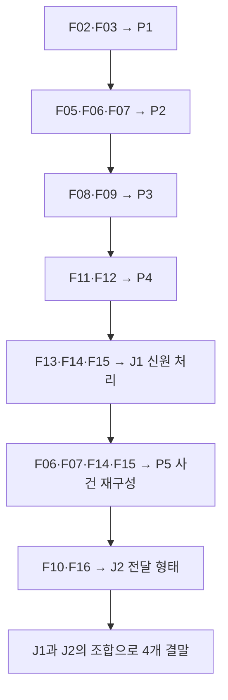
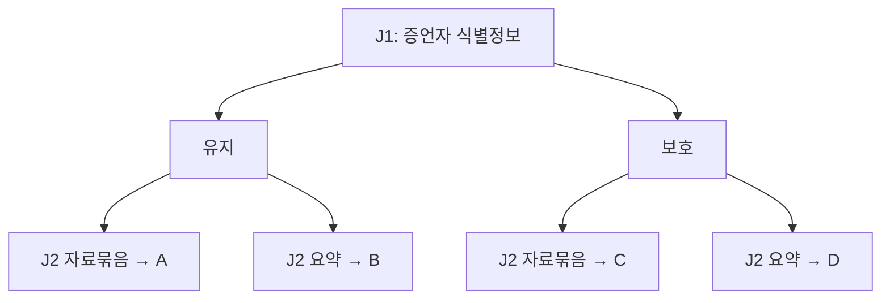

# 중고 컴퓨터의 비밀
## 에피소드 1 — 지워지지 않은 밤

**문서 종류:** PC 웹 추리게임 상세 제작 기획서  
**버전:** v1.1 / 2026-09-21 · 플레이타임·분기 확장 반영  
**상태:** 콘셉트 선택을 바탕으로 구체화한 검토용 설계안  
**작업 범위:** 기획 문서. 실제 게임·서버·결제·새 화면 목업은 제작하지 않음.  
**주의:** 제작자를 위한 문서이므로 퍼즐 정답·사건의 진실·엔딩을 모두 포함한다.

---

## 0. 요약과 확정 수준

### 0.1 한 문장 소개

중고 컴퓨터의 가상 바탕화면에서 메일·사진·삭제된 메모를 조사하고, 세 개의 잠금과 두 개의 복구·추론 퍼즐을 해결하고 조사 중의 선택으로 결말을 바꾸며 이전 주인이 사라진 이유를 밝히는 1인용 웹 추리게임.

### 0.2 사용자와 합의한 방향

- PC 브라우저에서 설치 없이 즐긴다.
- 실제 운영체제가 아닌 게임 안의 가상 바탕화면을 조사한다.
- 갑작스러운 큰 소리보다 천천히 드러나는 이상함과 추리로 긴장을 만든다.
- 마우스로 창·파일을 다루고 키보드로 비밀번호를 입력한다.
- 사건 1개를 유지하고 첫 플레이를 30~60분 정도로 확장한다. 조사 중의 선택이 영향을 주는 분기 엔딩을 포함한다.
- 이를 구현하기 위한 제안 범위는 조사 콘텐츠 16개, 핵심 퍼즐 5개(암호 3개+복구 검증 1개+사건 재구성 1개), 분기 결정 2회, 결말 4개다. 개수는 이번 수정의 제작 제안이다.
- 목표 플레이 시간은 정답을 모르는 첫 플레이 기준 30~60분, 중심 목표 40~45분이다. 실제 테스트 전의 목표이며, 빠른 독해·정답 힌트·재플레이까지 최소 30분을 강제하지 않는다.
- AI API 없이 미리 작성한 이야기·이벤트·조건 분기로 실행한다.
- 도입 문구: “이 컴퓨터를 구매하셨다면, 인터넷에 연결하기 전에 휴지통부터 확인해 주세요.”

### 0.3 이 문서에서 제안한 제작 기본값

인물·회사·날짜·정답·대사·잠금 순서·저장 규칙은 실행 가능한 설계를 위해 이번에 정한 초안이다. 별도의 사용자 승인 이력이 있는 사실로 취급하지 않는다. 향후 수정 시 관련 파일과 검수 항목을 함께 변경한다.

| 항목 | 제작 기본값 |
|---|---|
| 가제 | 중고 컴퓨터의 비밀 |
| 첫 사건 | 지워지지 않은 밤 |
| 장르 | 가상 데스크톱 조사 / 미스터리 / 가벼운 환경 퍼즐 |
| 주요 경험 | 두 자료를 비교한 뒤 스스로 정답을 알아내는 순간 |
| 대상 | 컴퓨터 조작에 익숙한 추리·방탈출 입문 이용자 |
| 플레이 단위 | 첫 플레이 30~60분 목표, 시간 제한·게임오버 없음 |
| 언어 | 한국어 1개 언어 |
| 이야기의 시점 | 2026년 4월 21일 밤, 가상의 사건 |
| 핵심 조작 | 파일 열기·휴지통 복원·자료 비교·암호 입력·최종 선택 |
| 사건 보상 | 진실 해설·엔딩 기록. 재화나 반복 성장 없음 |
| 수익 방향 | 첫 사건 무료 공개 검토, 이후 완성도 있는 추가 사건 팩 판매 |

수익 모델은 향후 검증할 가설이다. 첫 사건 구현에 결제·광고 SDK를 포함하지 않는다.

## 1. 경험 목표와 범위

### 1.1 반드시 전달할 감정

1. **호기심:** 평범한 중고 컴퓨터에서 예상하지 못한 안내를 발견한다.
2. **성취:** 휴지통과 사진을 연결해 첫 잠금을 직접 해제한다.
3. **의심:** 문서에 적힌 시간과 실제 시간이 일치하지 않음을 알아낸다.
4. **이해:** 이전 주인은 사고로 사라진 것이 아니라 기록을 지키기 위해 연락을 끊었다.
5. **결정:** 중간 조사에서 증언자의 신원 처리 방침을 정하고, 마지막에는 검증 자료와 요약 중 무엇을 전달할지 선택한다. 두 결정이 결말에 함께 반영된다.

### 1.2 성공 기준

- 별도 설명 없이 첫 바탕화면에서 조사할 대상을 찾을 수 있다.
- 외부 검색, 실제 파일 탐색, 프로그래밍·해킹 지식 없이 다섯 퍼즐을 해결할 수 있다.
- 색 구별·소리·빠른 손놀림·작은 이미지 속 글자에 정답을 의존하지 않는다.
- 잘못 입력하거나 창을 닫거나 새로고침해도 진도가 막히지 않는다.
- 엔딩에서 “왜 중고로 팔렸나 / 왜 연락을 끊었나 / 무엇이 바뀌었나”를 설명한다.
- 다른 엔딩을 보려고 처음부터 모든 퍼즐을 반복할 필요가 없다. 마지막 선택과 중간 분기 직전의 두 체크포인트를 제공한다.

### 1.3 포함 / 제외

| 포함 | 첫 버전 제외 |
|---|---|
| 가상 데스크톱, 파일 탐색기, 사진 뷰어, 로컬 메일 뷰어 | 실제 OS 접근, 사용자 PC 파일 읽기 |
| 삭제 문서 2개 복원, 잠금 3개·복구 검증·사건 재구성 | 파일 영구 삭제, 임의 파일 업로드 |
| 단서 기록보드, 3단계 힌트 | 자유로운 문장 입력을 해석하는 AI |
| 자동 저장, 이어하기, 엔딩 재선택 | 계정·클라우드 동기화·순위·채팅 |
| 환경음·자막, 글자 크기·모션 설정 | 성우 더빙, 3D 공간 이동, 전투 |
| 조사 선택 2회로 결정되는 엔딩 4개와 공통 해설 | 조건을 숨긴 추가 엔딩, 랜덤 사건 |
| 한국어 PC 웹 | 모바일 최적화·네이티브 앱·PWA 설치 보장 |

휴지통의 삭제 흔적은 이야기 소재다. 플레이어가 증거를 영구 삭제해 진행을 망치는 기능은 만들지 않는다.

## 2. 세계관과 사건의 진실

### 2.1 기본 설정

가상의 기록 정리 업체 **해온기록**은 고객이 맡긴 자료의 보관·폐기 내역을 관리한다. 직원 **윤서**는 실제 보관 위치와 회사 보고서가 다르다는 것을 발견한다. 일부 자료를 옮긴 뒤, 원래 그 위치에 자료가 없었던 것처럼 관리 번호를 바꾼 것이다.

윤서는 변경 전후의 기록을 자신의 검토용 컴퓨터에 저장한다. 문제를 지적한 뒤 그녀의 업무 접근 권한이 사라지고, 주변에는 “자료를 빼돌리고 잠적했다”는 말이 퍼진다. 윤서는 신뢰하는 지인 **정민**에게 컴퓨터를 맡기고 당분간 연락을 끊는다.

정민은 윤서의 요청에 따라 컴퓨터를 **모퉁이중고점**에 인계한다. 게임 속 거래는 단순 처분이 아니라, 구매자가 원하면 자료를 복구해 정민에게 전달할 수 있게 한 인계 절차다. 플레이어가 우연히 국가 기밀의 암호를 뚫는 설정으로 만들지 않는다.

### 2.2 왜 퍼즐이 있는가

- 세 잠금은 회사 보안 시스템이 아니라 윤서가 만든 **인계용 복구 패키지의 확인 절차**다.
- 원래 문서를 읽고, 시계의 오차를 이해하고, 변경 전 자료를 고를 수 있는지를 단계별로 확인한다.
- 누구나 추측 가능한 날짜 암호를 강력한 실제 보안처럼 설명하지 않는다.
- 회사의 자동 정리 작업을 피하려고 윤서는 복구 작업을 로컬 상태에서 끝내 달라고 부탁했다. 게임 내 연결 버튼은 최종 제출 단계에서만 활성화된다.
- 브라우저의 실제 온라인 상태와 게임 속 연결 상태는 별개다. 실제 네트워크를 끄도록 요구하지 않는다.

### 2.3 인물

| 인물 | 역할 | 플레이어에게 처음 보이는 모습 | 실제 상황 |
|---|---|---|---|
| 플레이어 | 중고 컴퓨터 구매자 | 싼 컴퓨터를 처음 켠 사람 | 외부 인계자이며 탐정·해커가 아님 |
| 윤서 | 이전 사용자, 기록 검수 직원 | 연락이 끊긴 사람 | 기록 사본을 지키려 잠시 몸을 숨겼고 살아 있음 |
| 정민 | 컴퓨터 인계자 | 중고점 안내 메일의 이름 | 윤서가 지정한 신뢰 가능한 자료 수신자 |
| 민아 | 야간 반입 직원, BK-04 | 복원된 백업 속 증언자 | 윤서 퇴실 뒤 내려온 지시로 상자를 옮겼으며 자기 신원이 자료 밖으로 나가는 것을 걱정함 |
| 관리 책임자 | 기록 수정 지시 주체 | 기록 속 `ADM` 계정 | 원본과 다른 관리 번호를 승인함. 상세 동기는 후속편에 의존하지 않아도 됨 |
| 중고점 | 거래 배경 | 접수 사진·인계 안내 제공 | 사건 조작에 가담하지 않음 |

실존 회사·인물·이메일·피해 사건을 모델로 하지 않는다. 모든 메일 주소는 동작하지 않는 `.invalid` 예시 주소다.

### 2.4 실제 시간 순서 — 제작자 기준

| 실제 날짜·시각 | 사건 | 게임 내 근거 |
|---|---|---|
| 4월 17일 | 검토용 컴퓨터가 중고점 수리 접수됨 | F03 접수 사진 |
| 4월 18일 낮 | 수리 완료된 컴퓨터가 윤서에게 반환됨 | F03 출고 표시 |
| 4월 18일 23:58 | 관리 계정이 보관 기록 수정 작업을 실행함 | F06 장치 시각 23:48, F07 오차 보정 |
| 4월 19일 00:06 | 윤서가 기록 보관실에서 나옴 | F06 장치 시각 23:56, F07 오차 보정 |
| 4월 19일 00:07 | 관리 계정이 민아에게 야간 반입 지시를 발행함 | F14 기준 시각 지시서 |
| 4월 19일 00:08 | 민아(BK-04)가 보관실에 반입 작업을 함 | F06 장치 시각 23:58, F07 오차 보정 |
| 4월 19일 00:10 | 물품 수령 확인이 촬영됨 | F15 기준 시각 촬영 확인 |
| 4월 19일 00:12 | 윤서가 원본 비교본과 미발송 메일 초안을 마무리함 | F08·F09·F10 |
| 4월 19일 00:15~00:20 | 민아의 증언·지시서·촬영 확인을 받아 로컬 백업과 인계 옵션을 추가함 | F11~F16, 첫 메일은 초안 작성 시각 유지 |
| 4월 19일 오전 | 정민이 컴퓨터를 중고점에 인계함 | F04 |
| 4월 21일 저녁 | 플레이어가 컴퓨터를 구매함 | 게임 시작 화면·F04 |
| 최종 선택 후 | 게임 속 수신함에 정민의 답신이 표시됨 | 엔딩 이벤트, 조사 파일 수에 포함하지 않음 |

F06의 세 이벤트는 모두 장치 날짜로 4월 18일이다. 장치가 실제보다 10분 느려 윤서의 퇴실과 반입 이벤트는 실제로는 다음 날이다. 날짜가 넘어가는 것이 두 번째 퍼즐의 핵심이며 설정 오류가 아니다.

### 2.5 논리적 한계도 이야기 안에서 지킨다

- 출입 로그만으로 윤서의 결백이나 관리 책임자의 모든 행위를 확정하지 않는다.
- F06·F07은 시각 해석의 오류를, F09는 번호 변경을, F10은 윤서의 의도를 보여준다. F13~F15는 퇴실 이후의 지시·반입·수령을 추가로 비교하게 한다.
- 좋은 엔딩은 원본 검토가 가능해지고 당사자의 생존이 확인되는 결말이다. 게임 속 자료 몇 개만으로 즉시 법적 유죄 판결이 나오는 이야기가 아니다.
- 윤서의 생존은 F10의 과거 편지만으로 확정하지 않고 마지막 정민의 답신으로 확인한다.

## 3. 전체 플레이 구조

### 3.1 목표 시간 분배

| 구간 | 조사·행동 | 목표 시간 |
|---|---|---|
| 도입 | 부팅·안내·초기 파일 위치 탐색 | 2~4분 |
| 1막: 주인이 남긴 흔적 | F01~F04, 휴지통 복원, 날짜 비교 P1 | 6~10분 |
| 2막: 맞지 않는 시계 | F05~F07, 행 선택·오차 비교 P2 | 7~12분 |
| 3막 전반: 바뀐 기록 | F08~F10, 원본 번호 정렬 P3 | 5~8분 |
| 3막 후반: 다른 증언 | F11~F15, 백업 검증 P4, 증언자 처리 분기 J1 | 5~12분 |
| 4막: 그날 밤의 순서 | 사건 재구성 P5, F16 검토, 전달 분기 J2, 엔딩 | 5~14분 |
| 합계 | 최초 엔딩 도달까지 | 30~60분 |

시간은 강제 대기·의무 애니메이션·읽기 잠금 없이 조사량과 비교 행동으로 확보한다. 기존 문서의 글자 수만 늘리는 방식은 사용하지 않는다. 정답을 아는 재플레이와 정답 힌트 이용자는 더 빠르게 끝낼 수 있다. 두 체크포인트를 이용한 추가 엔딩 감상은 최초 30~60분 목표와 별개다.

한 구간에서 오래 막히면 무료 힌트와 현재 목표가 즉시 도움이 되어야 한다. 분량이 부족하면 독립된 비교 행동을 보강하고, 시간이 넘치면 중복 문장·불필요한 창 이동부터 줄인다.

### 3.2 진행 상태

| 단계 ID | 진입 조건 | 새 내용·행동 | 다음 목표 |
|---|---|---|---|
| S0 | 새 조사 | F01·F03·F04, 휴지통 F02·F07 | 휴지통의 흔적 확인 |
| S1 | P1 해결 | F05·F06, P2 | 실제 퇴실 시각 찾기 |
| S2 | P2 해결 | F08·F09, P3 | 변경 전 번호 재정렬 |
| S3 | P3 해결 | F10·F11·F12, P4 | 손상되지 않은 인계 백업 선택 |
| S4 | P4 해결 | F13·F14·F15, J1 선택 전 체크포인트 | 증언자 식별정보의 처리 방침 결정 |
| S5 | J1 확정 | F16의 선택별 인계 메모, P5 | 다섯 사건과 근거를 실제 순서로 연결 |
| S6 | P5 해결·F10 열람 | 최종 검토, J2 선택 전 체크포인트 | 자료묶음 또는 요약 선택 |
| S7 | J2 최종 확인 | J1×J2 조합에 해당하는 A/B/C/D | 해설·분기 다시 보기 |

P1 이전에 F07을 복원하거나, S3에서 F10보다 F11·F12를 먼저 읽어도 된다. J1·J2는 선악 점수나 정답 퍼즐이 아니라 결과를 미리 설명하는 선택이다. J1을 확정하기 전에는 P5를 제출할 수 없고, P5를 해결하기 전에는 최종 전송을 선택할 수 없다.

### 3.3 단서 연결도



F01·F04는 도입과 인계자의 신원을, F13은 중간 선택의 맥락을 제공한다. 필수 단서를 그 단서로 열어야 하는 잠금 뒤에 두지 않는다. 자동 알림이 사라져도 모든 근거는 파일 안에 남는다.

## 4. 조사 콘텐츠 16개 — 식별자와 공개 조건

### 4.1 파일 개수의 정의

‘조사 파일 16개’는 아래 F01~F16을 뜻한다. F04 메일 1건도 조사 콘텐츠 하나로 센다. 폴더·힌트·설정·자동 알림·엔딩 답신·플레이어의 기록보드는 조사 파일 수에 포함하지 않는다. 화면용 PNG·오디오·웹 번들 개수와 혼동하지 않는다.

| ID | 표시 이름 | 시작 위치 / 복원 위치 | 공개 조건 | 핵심 용도 |
|---|---|---|---|---|
| F01 | 읽어주세요.txt | 바탕화면 | 처음부터 | 조사 시작·안전한 인계 안내 |
| F02 | 인계규칙_조각.txt | 휴지통 → 복원된 파일 | 복원 후 본문 | P1의 날짜 선택·형식 |
| F03 | 접수사진.jpg | 사진 | 처음부터 | P1의 접수일 |
| F04 | 컴퓨터 인계 안내 | 메일함 / 로컬 사본 | 처음부터 | 중고 판매 경위·정민의 역할 |
| F05 | 마지막_작업일지.txt | 작업기록 | P1 해결 | P2의 대상·입력 규칙 |
| F06 | 출입기록.csv | 작업기록 | P1 해결 | 윤서 퇴실의 장치 시각 |
| F07 | 시계점검.tmp | 휴지통 → 복원된 파일 | 복원 후 본문 | P2의 시계 오차 |
| F08 | 복구순서.txt | 복구보관함 | P2 해결 | P3의 정렬·원본 선택 규칙 |
| F09 | 보관번호_비교.csv | 복구보관함 | P2 해결 | 변경 전후 원본 비교·P3 값 |
| F10 | 보내지_못한_메일.eml | 발신보관함 | P3 해결 | 사건 설명·추가 복구 안내 |
| F11 | 백업_복구안내.txt | 발신보관함 / 인계 백업 | P3 해결 | P4의 세 가지 검증 기준 |
| F12 | 백업_목록.csv | 발신보관함 / 인계 백업 | P3 해결 | P4 후보와 항목별 검증 근거 |
| F13 | 야간직원의_메모.txt | 인계 백업 R2 | P4 해결 | 증언과 J1 신원 처리 선택 |
| F14 | 야간_반입지시.txt | 인계 백업 R2 | P4 해결 | P5의 실제 지시 시각 |
| F15 | 수령확인_사진.jpg | 인계 백업 R2 | P4 해결 | P5의 실제 수령 시각 |
| F16 | 인계_처리메모.txt | 인계 검토 | J1 확정 | J1 선택에 따른 자료 처리와 J2 영향 |

파일 위치는 게임 안의 가상 위치다. 브라우저 다운로드 폴더에 위 파일을 실제 생성하지 않는다.

### 4.2 F01 — 읽어주세요.txt / 본문 확정 초안

> 이 컴퓨터를 구매하셨다면, 인터넷에 연결하기 전에 휴지통부터 확인해 주세요.
>
> 저는 이 컴퓨터의 이전 사용자, 윤서입니다.
>
> 어떤 기록은 지워진 뒤에도 흔적이 남습니다. 휴지통의 두 조각은 제가 남긴 것입니다. 복원해도 컴퓨터의 다른 자료는 바뀌지 않습니다.
>
> 바탕화면의 ‘작업기록’은 잠겨 있습니다. 암호를 잊은 것이 아닙니다. 접수 사진과 제가 남긴 인계 규칙을 읽었다면 열 수 있도록 해뒀습니다.
>
> 다른 사람이 적어 놓은 시간을 그대로 믿지 마세요.
>
> 복구를 끝낸 뒤, 무엇을 남길지는 당신이 결정해 주세요.
>
> — 윤서

본문 아래 조작: **휴지통 열기**, **기록보드에 표시**. 본문을 처음 표시해도 자동으로 휴지통을 열지는 않는다.

### 4.3 F02 — 인계규칙_조각.txt / 복원 후 본문

> 인계 확인 1 — 작업기록
>
> 이 컴퓨터를 수리 맡겼던 ‘접수일’을 사용합니다.
> 사진에 있는 출고일이나 사진을 복사한 날짜는 사용하지 않습니다.
>
> 월 두 자리, 일 두 자리. 숫자 네 자리를 붙여 주세요.
> 한 자리 월·일 앞에는 0을 붙입니다.
>
> 사진은 ‘사진’ 폴더의 접수사진.jpg에 있습니다.

휴지통 메타데이터: 삭제 표시 2026-04-19 00:12, 복원 가능. 이 삭제 시각은 퍼즐 정답이 아니다. 복원 전에 이름·삭제 표시·복원 버튼만 보여주고 본문은 가린다.

### 4.4 F03 — 접수사진.jpg / 이미지 제작 명세와 동일 내용 텍스트

사진은 실제 존재하지 않는 중고점 접수대 위의 수리 접수증을 표현한다. 실사풍 또는 평면 일러스트 어느 쪽이든 아래 글자가 읽혀야 한다. 이미지 분위기에 정답을 숨기지 않는다.

```text
모퉁이중고점 — 수리 접수증
기기: 검토용 데스크톱
접수자: 윤서
접수일: 2026.04.17
출고일: 2026.04.18
접수 번호: R-218
작업: 전원 점검 / 저장 자료 변경 없음
```

사진 뷰어 아래 **사진 속 글자 보기** 버튼을 두며 동일한 텍스트를 표시한다. 사진 복사 시각은 2026-04-19 00:12로 별도 ‘파일 정보’에 표시할 수 있으나 정답에 쓰지 않는다. 확대·텍스트 대체 경로로 모두 접수일을 확인할 수 있어야 한다.

### 4.5 F04 — 컴퓨터 인계 안내 / 메일 전문

```text
보낸 사람: 모퉁이중고점 <shop@corner.invalid>
받는 사람: 구매자 보관함
날짜: 2026.04.21 18:40
제목: 컴퓨터 인계 안내

구매하신 컴퓨터는 4월 17일 점검을 접수받아
4월 18일 이전 사용자 윤서 님에게 돌려드린 기기입니다.

4월 19일 오전, 인계자 정민 님이 다시 맡기셨습니다.
이전 사용자의 요청으로 로컬 복구 안내와 문서 사본을 남겨 두었습니다.
원치 않으시면 조사를 진행하지 않으셔도 됩니다.

윤서 님은 현재 직접 연락을 받지 않는 상태입니다.
인계 자료의 지정 수신자는 정민 님입니다.
주소: handoff@corner.invalid

복구 안내의 마지막 단계까지 확인한 뒤 자료를 전달해 달라는 요청이 있었습니다.
상점은 자료 내용의 사실 여부를 확인한 곳은 아닙니다.
```

이는 저장된 거래 안내 사본이다. 이메일 주소 클릭은 실제 메일 앱을 열지 않으며 게임 내 수신자 설명을 보여준다.

### 4.6 F05 — 마지막_작업일지.txt / 본문

> 4월 19일, 인계 패키지를 만들며
>
> 회사에 남은 표에는 제가 ‘18일 밤’에 나갔다고 적혀 있습니다.
> 하지만 보관실 장치의 시계는 실제 시계와 맞지 않았습니다.
> 점검 때 두 시계를 동시에 적어 둔 조각을 찾아 주세요.
>
> 복구보관함의 암호는 출입기록에서 **YS-17, 보관실 퇴실**에 해당하는 실제 시각입니다.
> 장치가 늦는 만큼 더하고, 빠른 만큼 빼세요.
>
> 24시간제 시 두 자리와 분 두 자리, 총 네 자리로 입력합니다.
> 날짜가 바뀌어도 시각만 입력합니다. ‘24시’ 대신 다음 날 ‘00시’를 사용하세요.
>
> 단순히 늦은 퇴실을 증명하려는 것이 아닙니다.
> 누군가 기록을 바꾼 시각과 제 퇴실을 같은 기준으로 비교해야 합니다.

첫 열람 후 로컬 예약 알림 1회: **“예약 메모 · 시계점검 조각은 휴지통에 남겨 두었습니다.”** 알림이 사라져도 본문의 내용과 기록보드에서 다시 확인 가능하다.

### 4.7 F06 — 출입기록.csv / 표시 표

상단 고정 설명: **모든 날짜·시각은 장치가 기록한 값입니다. 실제 시각으로 보정되지 않았습니다.**

| 장치 날짜 | 장치 시각 | 계정 | 동작 |
|---|---|---|---|
| 2026-04-18 | 23:48 | ADM | 보관 번호 수정 작업 실행 |
| 2026-04-18 | 23:56 | YS-17 | 보관실 퇴실 |
| 2026-04-18 | 23:58 | BK-04 | 보관실 반입 |

사용자가 행을 선택하면 해당 행을 강조하고 기록보드에 표시할 수 있다. 행 선택은 정답 제출이 아니며 세 행 모두 언제든 다시 볼 수 있다.

### 4.8 F07 — 시계점검.tmp / 복원 후 본문

```text
보관실 시계 동시 점검
아래 두 줄은 같은 순간에 확인한 값입니다.

기준 시계: 2026.04.19 00:04
장치 시계: 2026.04.18 23:54

4월 18일 22:00부터 이 점검 이후까지 같은 오차가 유지됐습니다.
점검 후에도 장치 시계를 수정하지 못했습니다.
그 구간의 출입기록에는 모두 같은 오차를 적용해야 합니다.

— 윤서
```

휴지통 메타데이터는 F02와 동일한 삭제 표시 시각으로 둔다. 정답 대상의 퇴실 시각을 F07에 그대로 적지 않는다. 오차를 계산하는 자료다.

### 4.9 F08 — 복구순서.txt / 본문

> 인계 확인 3 — 발신보관함
>
> 비교표에는 변경 전 원본과 변경 후 값이 함께 들어 있습니다.
> 지금 화면에 보이는 행 순서가 원래 순서는 아닙니다.
>
> **원본 순번 1 → 2 → 3**으로 읽어 주세요.
> 각 행의 **변경 전 보관 번호**를 그대로 이어 붙이면 제출 확인 키가 됩니다.
>
> 공백이나 구분 기호는 넣지 않습니다.
> 영문자와 숫자를 합쳐 총 여섯 자리입니다.
>
> 이 키는 강력한 보안 암호가 아닙니다.
> 무엇이 바뀌었는지 확인한 뒤 마지막 메일을 열어 달라는 제 부탁입니다.

### 4.10 F09 — 보관번호_비교.csv / 본문과 표시 표

표 위 설명: **윤서가 변경 전 사본과 변경 후 출력물을 함께 보존한 인계용 비교본. 아래 보관 번호는 게임 속 가상 기록 식별자입니다.**

F09는 변경 전 행과 변경 후 행을 한 조사 문서 안에 보존한 콘텐츠다. 표의 ‘변경 전’ 열이 이 사건에서 전달할 원본 사본에 해당한다. 화면 밖에 별도의 미구현 원본 파일이나 추가 첨부파일이 있다고 가정하지 않는다. 원본의 존재가 회사 기록 전체의 진위를 보증한다는 뜻은 아니며 검토 가능한 출발점이다.

| 원본 순번 | 자료 묶음 | 변경 전 보관 번호 | 변경 후 보관 번호 | 승인 계정 |
|---|---|---|---|---|
| 3 | 출고 확인서 | D6 | D0 | ADM |
| 1 | 접수 원장 | A2 | A0 | ADM |
| 2 | 보관 목록 | C4 | C0 | ADM |

표 아래 문장:

> 변경 후 값은 빈 보관 위치를 가리킵니다. 자료가 없었다는 보고서는 이 값을 기준으로 작성되었습니다. 원본 위치의 자료가 실제로 사라졌는지 여부는 별도 확인이 필요합니다. 이 비교본은 원본 사본과 함께 남겨야 검토할 수 있습니다.

첫 버전에서는 열 정렬 버튼을 제공하지 않는다. 표를 종이에 적거나 기록보드와 비교해 순서를 알아내게 한다. 글자 크기 조절·읽기 순서·화면 낭독은 지원한다.

### 4.11 F10 — 보내지_못한_메일.eml / 메일 전문

```text
보낸 사람: 윤서 <local-owner@handoff.invalid>
받는 사람: 정민 <handoff@corner.invalid>
작성: 2026.04.19 00:12
상태: 인계자 확인 대기
제목: 제가 남긴 것은 빈 폴더가 아닙니다

정민에게,

저는 이 메일을 쓰는 지금 살아 있습니다.
직접 연락하면 제가 맡겼던 기록까지 다시 정리될 것 같아
당분간 연락을 끊고 안전한 곳으로 가려고 합니다.

세 자료 묶음은 처음부터 비어 있던 것이 아닙니다.
위치 번호가 바뀌었고, 바뀐 번호로 작성한 보고서만 남았습니다.
제 이름으로 남은 퇴실 기록도 장치 시각을 그대로 옮긴 것입니다.

혼자 살아남는 것과, 있었던 일을 설명할 수 있는 것은 다르다는 걸 알았습니다.
그래서 비교본뿐 아니라 원본 사본과 시간 점검 메모도 함께 남깁니다.

컴퓨터를 다른 사람에게 인계해도 좋습니다.
대신 복구를 끝낸 사람이 어떤 자료를 전달하는지 직접 확인할 수 있게 해 주세요.
인계 과정은 이야기의 일부로 남겨 주세요.

이 메일을 읽는 분께:
저를 대신해 위험을 감수하라고 강요하지 않겠습니다.
요약만 전달해도 제가 남긴 말은 도착합니다.
다만 원본과 복구 경위가 없으면 기록이 어떻게 바뀌었는지 검증하기 어렵습니다.

추가 백업에는 그날 밤 다른 직원이 남긴 증언과 인계 안내가 있습니다.
백업을 확인하고 사건의 순서를 연결한 뒤 마지막 화면에서 전달할 자료의 형태를 골라 주세요.
감사합니다.

윤서
```

메일 끝 조작: **인계 백업 확인**. F11·F12가 있는 백업 목록으로 이동한다. 아직 최종 제출 화면으로 건너뛰지 않는다.

### 4.12 F11 — 백업_복구안내.txt / 본문

> 인계 백업 추가 기록 — 4월 19일 00:20
>
> 저장을 반복하다 생긴 복사본 셋 중 온전한 백업 하나를 골라 주세요.
> 다음 세 조건을 모두 만족해야 합니다.
>
> 1. 원본 순번 1·2·3이 각각 한 번씩 있다.
> 2. 각 순번에는 변경 전과 변경 후 항목이 하나씩 있어 전체 항목 수가 6이다.
> 3. 오류 검사 결과가 정상이다.
>
> 이름이 ‘최종’이거나 더 최근에 저장됐다는 이유만으로 고르지 마세요.
> 복구한 뒤에는 야간 직원의 메모와 지시서, 수령 사진을 함께 읽어 주세요.

### 4.13 F12 — 백업_목록.csv / 표시 내용

| 후보 ID | 표시 이름 | 순번별 항목 구성 | 전체 항목 수 | 오류 검사 |
|---|---|---|---|---|
| R1 | 인계_최종 | 1: 전·후 / 2: 전·후 / 2: 전·후 | 6 | 정상 |
| R2 | 인계_검토본 | 1: 전·후 / 2: 전·후 / 3: 전·후 | 6 | 정상 |
| R3 | 인계_최종수정 | 1: 전·후 / 2: 전·후 / 3: 전·후·후·후 | 8 | 불일치 |

복구 화면에서는 후보를 선택한 뒤 ‘순번 구성’, ‘항목 수’, ‘오류 검사’를 각각 판정하고 제출한다. F12는 백업의 검증 요약이며, 백업을 열기 전에도 읽을 수 있다. R2 복구 결과는 F13~F15 세 조사 파일이다. 표의 항목 6개는 기존 비교 데이터의 행 항목 수이며 새 조사 파일 6개를 뜻하지 않는다.

### 4.14 F13 — 야간직원의_메모.txt / 전문

```text
작성: 2026.04.19 00:15
작성자: 민아 / 야간 반입 계정 BK-04

윤서 님은 제가 반입 지시를 받기 전에 보관실을 나갔습니다.
저는 관리 계정에서 온 야간 반입 지시를 받고 상자를 옮겼습니다.
지시서 시각과 수령 사진을 같이 남깁니다.
무엇이 수정되었는지까지 제가 본 것은 아닙니다.

이 자료가 필요하다는 것은 압니다.
하지만 제 이름과 직원 계정이 전달되는 것은 걱정됩니다.
자료를 보내기 전에 식별정보를 어떻게 처리할지 확인해 주세요.
이름을 빼더라도 시간과 어떤 작업을 했는지는 남겨 주세요.
```

본문 아래 **식별정보 처리 방침 선택** 버튼으로 J1을 연다. 처음 문서를 열었다고 선택을 확정하지 않는다. 이야기 안의 작성자 요청이며 현실의 법적 동의·개인정보 절차를 대체한다는 설명은 하지 않는다.

### 4.15 F14 — 야간_반입지시.txt / 전문

```text
야간 반입 지시 / 작성 기준: 기준 시계
발행: 2026.04.19 00:07
발행 계정: ADM
수행 계정: BK-04
작업: 반환 보관함으로 기록 상자 1개 반입

지시를 받은 뒤 보관실에 들어가고,
수령 완료 시 기준 시계 표시가 포함된 확인 사진을 남길 것.
```

‘기준 시계’이므로 F07의 +10분 보정을 다시 적용하지 않는다. 이를 파일 제목 아래에서도 보여준다. 시계가 다른 자료를 구별하는 것이 P5의 비교 행동이다.

### 4.16 F15 — 수령확인_사진.jpg / 이미지·동일 내용 텍스트

이미지는 기록 상자 1개와 전자 확인표를 보여준다. 인물 얼굴은 없다. 사진 속 글자 보기에서 아래 내용을 동일하게 제공한다.

```text
반환 보관함 — 물품 수령 확인
확인 시각(기준 시계): 2026.04.19 00:10
수령 계정: BK-04
상자 수: 1
처리: 반입 완료
```

사진 속 시계는 이미 실제 기준 시각이다. 사진 자체의 복사 시각은 퍼즐에 쓰지 않는다.

### 4.17 F16 — 인계_처리메모.txt / 조건별 전문

제목 아래 **로컬 인계 절차가 생성한 처리 메모**라고 표시한다. 외부 인물의 실시간 답장처럼 연출하지 않는다.

J1이 `protect`일 때:

> 식별정보 보호를 선택했습니다.
> 전달용 사본에서는 민아라는 이름과 BK-04 계정을 일관된 별칭 W1로 바꿉니다. 사건 시각·지시 내용·보관 번호는 바꾸지 않습니다.
> 원문은 이 컴퓨터에 남습니다. 보호 사본은 원본과 완전히 같은 문서라고 표시하지 않습니다.
> 다음 선택에서 검증 자료묶음을 전달하면 시간표와 번호 비교 근거를 함께 남길 수 있습니다. 요약만 전달하면 그 근거는 이 컴퓨터에 남습니다.

J1이 `identify`일 때:

> 식별정보 유지를 선택했습니다.
> 전달할 내용에 민아의 이름과 BK-04 계정을 유지합니다. 요약만 보내더라도 작성자 식별정보가 포함됩니다.
> 이름이 전달되는 것을 걱정한 작성자의 요청도 기록에 남습니다. 다음 선택에서 자료묶음을 보내면 원본 비교 근거가 포함되고, 요약만 보내면 이름과 진술만 남습니다.

두 본문 아래 공통 문장: “아직 아무 자료도 전송하지 않았습니다. 최종 검토에서 현재 방침과 전달 범위를 다시 확인할 수 있습니다.”

## 5. 핵심 퍼즐 5개 — 정답·판정·힌트

### 5.1 공통 규칙

- P1~P3 잠금 화면에는 대상 이름·형식·입력·확인·힌트를 표시한다. P4·P5는 선택·배열형 퍼즐이며 아래 별도 제출 규칙을 적용한다.
- 입력값은 숫자처럼 보여도 문자열로 다뤄 앞자리 0을 보존한다.
- Unicode NFKC 정규화 후 앞뒤 공백을 제거한다. P3만 영문자를 대문자로 바꾼다.
- 내부 공백·하이픈·콜론은 자동으로 없애지 않고 올바른 형식을 안내한다.
- P1·P2는 ASCII 숫자 정확히 4자리, P3는 ASCII 영문자·숫자 정확히 6자리다.
- 필수 자료를 ‘열어본 횟수’를 정답 조건으로 삼지 않는다. 이전 단계가 열려 있고 정답을 알고 있으면 통과한다.
- 오답 횟수 제한·대기 시간·시간 감소·보상 삭감은 없다.
- 빈 입력·형식 오류는 오답 횟수에 포함하지 않는다. 올바른 형식의 오답 제출만 해당 잠금의 시도 횟수를 늘린다.
- 입력 중에는 전체 브라우저 단축키를 가로채지 않는다. Enter는 입력 칸에 초점이 있을 때 제출한다.
- 성공 상태는 한 번만 적용한다. 빠르게 여러 번 눌러도 파일·알림·진도가 중복 생성되지 않는다.

### 5.2 P1 — 접수일

| 항목 | 내용 |
|---|---|
| 대상 | 작업기록 폴더 |
| 전제 | S0에서 폴더 아이콘에 접근 가능 |
| 단서 | F02 날짜 선택 규칙, F03 접수일 |
| 풀이 | 접수일 2026.04.17 → 월일 네 자리 |
| 정답 | `0417` |
| 화면 문구 | 접수일의 월·일을 숫자 네 자리로 입력하세요. |
| 오답 | 접수일과 출고일을 다시 비교해 보세요. |
| 성공 | 작업기록을 열었습니다. |
| 공개 | F05·F06, P2 진입점 |

힌트 1: “휴지통에서 복원한 인계 규칙은 어떤 날짜를 쓰라고 하나요?”  
힌트 2: “접수사진의 접수일은 4월 17일입니다. 월·일을 각각 두 자리로 적으세요.”  
힌트 3: “정답은 0417입니다. 출고일 4월 18일은 사용하지 않습니다.”

### 5.3 P2 — 실제 퇴실 시각

| 항목 | 내용 |
|---|---|
| 대상 | 작업기록 안의 복구보관함 |
| 전제 | P1 해결 |
| 단서 | F05 대상·형식, F06 YS-17 퇴실 시각, F07 동시 시계 점검 |
| 풀이 1 | 실제 00:04와 장치 23:54는 같은 순간 → 장치가 10분 느림 |
| 풀이 2 | 장치 퇴실 23:56 + 10분 → 다음 날 실제 00:06 |
| 정답 | `0006` |
| 화면 문구 | 윤서의 실제 퇴실 시각을 24시간제 네 자리로 입력하세요. |
| 오답 | 장치의 오차 방향과 자정이 지나는 순간을 확인해 보세요. |
| 성공 | 서로 다른 시계가 같은 밤을 가리키기 시작합니다. |
| 공개 | F08·F09, P3 진입점 |

힌트 1: “시계점검의 두 줄은 같은 순간입니다. 어느 시계가 늦나요?”  
힌트 2: “장치가 10분 느립니다. YS-17의 23:56에 10분을 더하세요.”  
힌트 3: “실제 퇴실은 다음 날 00:06입니다. 정답은 0006입니다.”

보조 피드백: `2356`을 입력하면 “이 값은 장치 시각입니다.”, `2406`은 “자정 이후는 00시로 적습니다.”라고 안내한다. 이 값들도 형식이 맞는 오답이므로 시도 횟수는 증가한다.

### 5.4 P3 — 변경 전 기록 재정렬

| 항목 | 내용 |
|---|---|
| 대상 | 복구보관함 안의 발신보관함 |
| 전제 | P2 해결 |
| 단서 | F08 순서·열 선택, F09 원본 순번과 변경 전 번호 |
| 풀이 | 원본 순번 1, 2, 3에 맞는 변경 전 번호 A2, C4, D6을 이어 붙임 |
| 정답 | `A2C4D6` |
| 화면 문구 | 원본 순번대로 변경 전 번호를 연결한 여섯 자리를 입력하세요. |
| 오답 | 화면 행 순서와 원본 순번, 변경 전·후 열을 다시 확인해 보세요. |
| 성공 | 발신보관함을 복구했습니다. |
| 공개 | F10·F11·F12, P4 |

힌트 1: “보이는 행 순서는 3, 1, 2입니다. 원본 순번으로 다시 읽으세요.”  
힌트 2: “1번 A2, 2번 C4, 3번 D6입니다. 변경 후 열은 쓰지 않습니다.”  
힌트 3: “정답은 A2C4D6입니다. 공백 없이 입력하세요.”

`a2c4d6`과 앞뒤 공백이 있는 정답은 허용한다. `D6A2C4`는 표시된 행 순서를 따른 오답, `A0C0D0`은 변경 후 값을 따른 오답으로 일반 안내를 표시한다.

### 5.5 P4 — 온전한 인계 백업 검증

- 전제: P3 해결. F11·F12가 모두 접근 가능하다.
- 입력: 후보 ID 1개와 세 조건 각각의 ‘통과/불통과’ 판정. 미선택 항목이 있으면 제출 형식 안내만 한다.
- 정답: **R2 + 순번 구성 통과 + 항목 수 통과 + 오류 검사 통과**.
- R1은 순번 2가 중복되고 3이 없어 탈락한다. R3은 항목 수 8과 오류 검사 불일치로 탈락한다.
- 후보만 맞거나 조건 판정만 맞아도 완료로 처리하지 않는다. 검증 항목에 맞지 않는 부분을 다시 확인하라고 안내하며 영구 실패는 없다.
- 성공 시 R2 복구 완료, F13·F14·F15 공개, J1 전 체크포인트 기록.
- 힌트 1: “표시 이름보다 원본 순번이 각각 한 번 있는지 확인하세요.”
- 힌트 2: “R1은 2가 중복되고 R3은 항목 수와 오류 검사가 맞지 않습니다.”
- 힌트 3: “R2를 고르고 순번·항목 수·오류 검사를 모두 통과로 표시하세요.”

### 5.6 P5 — 그날 밤의 사건 재구성

- 전제: P4 해결·J1 확정. F06·F14·F15와 F16을 다시 열 수 있다. F07을 아직 복원하지 않은 경우 근거 선택 옆의 ‘시계점검 복원’으로 휴지통의 해당 항목을 복원할 수 있다. 필수 단서를 새 잠금 뒤에 숨기지 않는다.
- 사건 카드 5개에 근거 파일을 각각 연결하고, 실제 시각 순서대로 배치한다. 드래그 외에 위로/아래로 버튼과 근거 선택 드롭다운을 제공한다.
- 카드에는 사건명과 자료 찾기 버튼만 표시하고 실제 시각을 처음부터 자동 계산해 주지 않는다. 플레이어가 선택한 시각과 근거는 검토 전까지 임시 값이다.

| 카드 ID | 사건 | 정답 실제 시각 | 필수 근거 |
|---|---|---|---|
| T1 | 관리 계정의 보관 번호 수정 | 4월 18일 23:58 | F06 + F07 |
| T2 | 윤서의 보관실 퇴실 | 4월 19일 00:06 | F06 + F07 |
| T3 | 야간 반입 지시 발행 | 4월 19일 00:07 | F14 |
| T4 | 야간 직원의 보관실 반입 | 4월 19일 00:08 | F06 + F07 |
| T5 | 물품 수령 확인 | 4월 19일 00:10 | F15 |

- 정답 순서: **T1 → T2 → T3 → T4 → T5**. 초기 배열은 T4·T1·T5·T2·T3으로 고정한다.
- 각 카드의 시각은 위 다섯 정답 시각과 ‘4월 18일 23:56’, ‘4월 19일 00:17’ 중 선택한다. 날짜까지 포함해 표시한다.
- 근거는 F06·F07·F14·F15 네 항목의 체크박스로 연결한다. 위 표의 정확한 집합이어야 통과한다. F06만 선택하면 장치 오차 근거가 빠진 것으로 안내한다.
- 다섯 카드가 한 번씩 있고, 순서·시각·근거가 모두 맞을 때 완료한다. 순서만 외워서 누르는 것으로 끝내지 않는다.
- 입력이 비어 있으면 미완성 안내. 완성된 제출이 틀리면 틀린 카드의 종류(시각/근거/순서)만 강조하고 나머지 임시 입력은 유지한다.
- 성공 후 “윤서의 퇴실 뒤에 반입 지시와 작업이 이어졌습니다. 이 자료만으로 모든 책임을 확정할 수는 없습니다.”를 표시한다.
- 힌트 1: “출입기록만 장치 시각입니다. 지시서와 수령 사진은 기준 시계입니다.”
- 힌트 2: “수정 23:58 → 퇴실 00:06 → 지시 00:07 → 반입 00:08 → 수령 00:10 순서입니다.”
- 힌트 3: 위 정답 표를 그대로 보여준다. 자동 완료는 하지 않고 사용자가 입력을 확인해 제출한다.

### 5.7 힌트 정책

- 힌트는 처음부터 무료로 이용할 수 있다. 광고·결제·오답 횟수와 연동하지 않는다.
- 버튼을 누를 때 1→2→3 순으로 한 단계씩 공개하며 이미 본 힌트를 다시 볼 수 있다.
- 3단계 공개 전 “다음 힌트에는 정답이 포함됩니다.”와 **정답 보기 / 돌아가기**를 표시한다.
- 같은 퍼즐에서 형식이 완성된 오답 제출이 3회 쌓이면 힌트 버튼 옆에 “도움이 필요하면 힌트를 확인하세요.”를 표시한다. 자동으로 답을 펼치지 않는다.
- 힌트 사용 여부는 개인 사건 기록에만 남기며 엔딩 조건·가격·업적에 불이익을 주지 않는다.

## 6. 조사 중 선택과 4개 분기 엔딩

### 6.1 J1 — 증언자의 식별정보 처리

P4로 백업을 복구한 뒤 F13의 메모를 확인하는 구간에서 결정한다. 선택 전 체크포인트를 만든다. 선택지는 기본값 없이 표시하며 확인을 한 번 더 받는다.

| 선택 | 저장 값 | 사전 고지 | 즉시 반영 |
|---|---|---|---|
| 식별정보를 보호한다 | protect | 전달용 사본에서 이름·직원 계정을 별칭으로 바꿉니다. 원문은 로컬에 남고 시각·작업·번호는 보존됩니다. | F16 보호 본문, 전달 자료의 미리보기에서 W1 표시 |
| 식별정보를 유지한다 | identify | 이름과 직원 계정이 자료묶음뿐 아니라 요약에도 포함됩니다. 증언자의 신원 노출 우려가 남습니다. | F16 유지 본문, 미리보기에 이름·계정 유지 |

게임 규칙의 정답은 없다. 선택 후 본문 F01~F15를 실제로 변경·삭제하지 않는다. 전달용 미리보기만 바꾸고 P5에서는 원문을 계속 비교할 수 있다. 최종 검토 전까지 실제 전송은 없지만, 이번 조사에서 선택을 바꾸려면 J1 전 체크포인트로 돌아가 이후 구간을 다시 진행한다.

J1의 영향은 F16·작업표시줄의 ‘식별정보 보호/유지’·최종 첨부 미리보기·엔딩 답신에 나타난다. 마지막 버튼만 다른 단순 결말 선택으로 만들지 않는다.

### 6.2 J2 — 최종 전달 범위

P5 해결 및 F10 열람 후 S6 검토 화면에 진입한다. 수신자는 `정민 · handoff@corner.invalid`로 고정한다. J1 방침과 전달될 항목을 먼저 보여준다.

인계 준비 단계에서 미복원 F02·F07이 있으면 복원 집합에 추가하고 안내한다. 이미 직접 복원한 경우 중복 생성하지 않는다. 정답을 아는 이용자에게도 필요한 전달 자료가 빠지지 않는다. F13~F15는 P4를 해결했으므로 이미 접근 가능하다.

| 선택 | 저장 값 | 사전 고지 |
|---|---|---|
| 검증 자료묶음 전달 | full | F09 비교 기록, F06·F07 시간 근거, F13~F15 증언·지시·수령 기록, F10·F16 인계 경위를 함께 전달합니다. 보호 선택 시 식별정보를 치환한 사본임을 표시합니다. |
| 요약만 전달 | summary | 사건 요약만 전달하며 원본 비교·시간·지시 근거는 첨부하지 않습니다. J1에서 유지한 식별정보는 요약에도 들어갑니다. |

보호 사본은 F06·F13·F14·F15 등의 `민아`와 `BK-04`를 일관되게 `증언자 W1`으로 치환해 연결 관계를 유지한다. 원본 변경이라고 주장하지 않으며 원본은 로컬에 보존한다. 전달 미리보기에는 ‘식별정보 치환 사본’ 표시가 반드시 있어야 한다. 이는 서사상의 검토 가능성으로, 현실의 증거능력이나 익명성 보장을 의미하지 않는다.

마지막 확인창에 J1과 J2를 함께 요약하고 **이대로 전달 / 돌아가기**를 제공한다. 숨겨진 클릭 횟수·읽음 수·힌트·소요 시간으로 결말을 바꾸지 않는다.

### 6.3 결정표 — 겹치거나 빠지는 조건 없음

| J1 식별정보 | J2 전달 범위 | 엔딩 | 사건의 결과 |
|---|---|---|---|
| identify | full | A · 이름을 되찾은 사람 | 검토 근거는 남지만 증언자의 신원도 전달됨 |
| identify | summary | B · 남겨진 이름 | 신원은 전달됐지만 기록 변경을 검토할 근거가 부족함 |
| protect | full | C · 증언을 지킨 밤 | 식별정보 노출을 줄인 사본과 검토 근거가 함께 전달됨 |
| protect | summary | D · 조용한 귀환 | 당사자들의 신원을 덜 드러내지만 진실 검토는 미완성 |

C는 모든 근거와 증언자의 요청을 함께 고려한 결말로 연출한다. A/B/D도 조사가 중단되는 게임오버가 아니라 각각 마무리와 해설이 있는 결말이다. 네 결말 모두 정민의 답신으로 윤서의 생존을 확인한다. 회사의 책임이 법적으로 확정됐다는 문장은 넣지 않는다.



### 6.4 엔딩 A — 이름을 되찾은 사람 / 답신 전문

> 윤서는 안전합니다.
>
> 전달된 기록으로 보관 번호의 변경과 실제 사건 순서를 검토할 수 있게 됐습니다. 이제 그녀의 말과 기록을 대조할 수 있습니다.
>
> 다만 민아의 이름과 직원 계정도 전달되었습니다. 작성자가 걱정했던 일이기도 합니다. 검토 과정에서 그 사람을 어떻게 보호할지도 함께 고민해야겠습니다.
>
> 윤서는 “지워진 건 제가 아니라 저를 설명할 순서였어요”라는 말을 남겼습니다. 그 순서를 되찾아 주셔서 감사합니다.

마지막 문장: **진실을 설명할 기록이 도착했습니다. 그 기록 속 사람도 함께 드러났습니다.**

### 6.5 엔딩 B — 남겨진 이름 / 답신 전문

> 윤서는 안전합니다. 그 사실부터 알려 드립니다.
>
> 민아가 무슨 말을 했는지는 받았습니다. 하지만 비교 기록과 시간 근거가 없어 그 말을 대조할 수는 없습니다.
>
> 한 사람의 이름과 진술은 전달됐고, 그 진술을 확인할 자료는 컴퓨터에 남았습니다. 저는 받은 요약을 사실로 확정해 퍼뜨리지 않겠습니다.
>
> 무엇을 더 남길 수 있는지는 아직 당신이 결정할 수 있습니다.

마지막 문장: **이름은 도착했지만, 그 이름을 지탱할 기록은 도착하지 않았습니다.**

### 6.6 엔딩 C — 증언을 지킨 밤 / 답신 전문

> 윤서는 안전합니다. 전달해 주신 자료를 확인했습니다.
>
> 증언자의 식별정보가 치환된 사본이라는 설명도 받았습니다. 사건의 시각과 지시, 보관 번호가 이어져 있어 무엇이 바뀌었는지 비교할 수 있습니다.
>
> 이름을 무작정 드러내지 않고도 이야기를 확인할 단서를 남겨 주셨습니다. 원본은 보존하고, 이후 확인이 필요하면 당사자의 의사를 먼저 묻겠습니다.
>
> 윤서가 전해 달라고 했습니다. “제 기록만이 아니라, 함께 그 밤을 지나온 사람도 지켜 주셨군요.”

마지막 문장: **당신은 그날 밤의 기록과, 기록 속 사람을 함께 남겼습니다.**

### 6.7 엔딩 D — 조용한 귀환 / 답신 전문

> 윤서는 안전합니다. 전달된 요약도 읽었습니다.
>
> 증언자의 이름을 드러내지 않은 선택은 이해합니다. 다만 요약만으로는 기록이 어떻게 바뀌었는지 검토할 수 없습니다.
>
> 윤서에게 혼자가 아니라는 사실은 전하겠습니다. 지금은 두 사람에게 조용한 시간이 필요할지도 모르겠습니다.
>
> 언젠가 자료를 더 남기기로 결정한다면, 그때 이야기를 이어가겠습니다.

마지막 문장: **누군가는 조용히 돌아갈 수 있었습니다. 그날 밤의 진실은 아직 컴퓨터 안에 있습니다.**

### 6.8 분기 재플레이와 해설

- 엔딩 확정 때 J1·J2·결말·본 엔딩 목록을 원자적으로 저장한다.
- **마지막 선택 다시 보기:** CP_FINAL로 복귀. J1·P1~P5는 유지하고 J2·현재 엔딩만 지운다. 같은 신원 방침 아래 두 결말을 비교한다.
- **증언자 선택부터 다시 보기:** CP_WITNESS로 복귀. P1~P4와 그 시점의 복원·열람·기록을 복구하고 J1·J2·P5·F16 생성 상태·현재 엔딩을 지운다. J1 선택 후 P5만 다시 진행한다.
- 재플레이 시 이미 푼 P5의 정답 보기 버튼은 제공할 수 있지만 사용자가 확인해 제출해야 한다. 처음 플레이의 목표 시간을 이 재플레이에 강제하지 않는다.
- 두 체크포인트에는 자기 자신이나 다른 체크포인트를 포함하지 않는 상태 스냅샷만 저장한다. 엔딩 목록과 현재 사용자 설정은 복귀 전의 최신 값을 유지한다.
- F16의 이전 분기 본문과 핀을 폐기하고 새 선택으로 다시 생성한다. 이후 이벤트 중복·이전 이름 노출을 검수한다.
- 해설은 현재 결말의 인과와 공통 사건을 먼저 보여준다. 아직 보지 않은 결말은 제목·조건을 기본적으로 가리고, **전체 분기 해설 보기**를 명시적으로 선택했을 때 결정표를 공개한다.
- **처음부터 다시 조사**는 현재 조사와 체크포인트를 초기화하되 이미 본 네 엔딩 목록은 유지한다. **개인 기록 전체 삭제**는 별도 확인 후 모두 삭제한다.

모든 연결·전달·답신은 게임 속 연출이다. 실제 이메일 발송·외부 파일 업로드는 없다.

## 7. 화면과 조작 설계

### 7.1 전체 화면 목록

| ID | 화면 | 주요 요소 | 진입·이탈 |
|---|---|---|---|
| UI01 | 시작 화면 | 제목, 새 조사, 이어하기, 설정, 가상 컴퓨터 안내 | 새 조사 또는 저장 상태로 진입 |
| UI02 | 부팅 연출 | 전원 표시, 짧은 부팅 문구, 건너뛰기 | 최대 3초 후 바탕화면 |
| UI03 | 바탕화면 | 파일·폴더 아이콘, 작업표시줄, 상태 표시 | 기본 작업 공간 |
| UI04 | 파일 탐색기 | 폴더 제목, 경로, 목록, 뒤로 | 폴더·휴지통 조사 |
| UI05 | 문서·표 뷰어 | 제목, 본문·표, 기록 표시 | 파일 내용 비교 |
| UI06 | 사진 뷰어 | 이미지, 확대·축소, 글자 보기 | F03 확인 |
| UI07 | 메일 뷰어 | 발신·수신·날짜·본문, F10 백업 확인 버튼 | F04 또는 F10 |
| UI08 | 잠금 확인 | 형식, 입력, 확인, 힌트 | 정답이면 관련 폴더 열기 |
| UI09 | 기록보드 | 표시한 단서, 현재 목표, 예약 알림 기록 | 조사 중 수시 접근 |
| UI10 | 최종 검토 | 두 선택지, 영향 설명, 확인 | 엔딩 분기 |
| UI11 | 엔딩·해설 | 답신, 결말, 풀이, 두 체크포인트 | S4·S6 또는 시작 화면 복귀 |
| UI12 | 설정·도움말 | 소리, 글자 크기, 모션, 저장 상태, 초기화 | 현재 진행으로 복귀 |
| UI13 | 백업 검증 | 후보·세 검증 항목·힌트 | P4 복구 |
| UI14 | 증언자 처리 | 보호/유지·영향 설명·확인 | J1 확정 |
| UI15 | 사건 재구성 | 사건 카드·시각·근거 선택·위아래 이동 | P5 검토 |

### 7.2 시작 화면 안내

시작 버튼 위 한 문장:

> 이 게임은 웹페이지 안의 가상 컴퓨터를 조사하는 이야기입니다. 실제 PC의 파일이나 메일을 읽거나 바꾸지 않습니다.

공포 표현 안내는 “어두운 분위기와 짧은 화면 변화가 있습니다. 큰 소리의 갑작스러운 놀람 연출은 없습니다.”로 둔다. 실제 등급을 심사 없이 표기하지 않는다.

### 7.3 바탕화면 배치

| 위치 | 구성 | 이유 |
|---|---|---|
| 왼쪽 첫 열 | 읽어주세요.txt → 사진 → 메일함 | 자연스러운 조사 시작점 |
| 왼쪽 둘째 열 | 작업기록 → 복원된 파일 | 복구 전후 상태를 비교 |
| 왼쪽 아래 | 휴지통 | 첫 문구와 연결되는 명확한 대상 |
| 가운데 | 열어둔 문서 창 | 자료 두 개를 나란히 비교 |
| 오른쪽 위 | 현재 목표 1줄, 기록보드 버튼 | 헤맬 때 다음 행동 확인 |
| 아래 작업표시줄 | 시작 화면, 열린 창 목록, 도움말, 소리, ‘로컬’ 상태, 극중 날짜 | 조사 조작과 앱 전체 기능 구분 |

초기 바탕화면에는 모든 조사 파일을 흩어 놓지 않는다. 초기 아이콘 6개와 휴지통 1개 이내로 제한하고 사건 파일은 폴더 안에서 발견한다. 실제 OS·브랜드 로고·시스템 경고창을 그대로 복제하지 않는다.

### 7.4 창 관리

- 파일·폴더 아이콘은 한 번 클릭하면 선택, 더블클릭 또는 선택 후 Enter로 연다. 선택 시 눈에 보이는 **열기** 버튼도 제공한다.
- 같은 파일을 다시 열면 기존 창을 앞으로 가져온다. 같은 내용의 창을 여러 개 만들지 않는다.
- 일반 창은 최대 4개 유지한다. 다섯 번째를 열면 가장 오래 비활성 상태였던 일반 창을 최소화한다. 열린 창 목록에서 복원할 수 있다.
- 최소화·닫기는 파일·진행을 삭제하지 않는다. 닫았던 문서를 다시 열 수 있다.
- 제목 표시줄을 드래그해 이동한다. 창의 제목과 닫기 버튼이 화면 밖으로 완전히 나가지 않도록 제한한다.
- 창 크기 자유 조절은 첫 버전에서 제외한다. **기본 / 왼쪽 나란히 / 오른쪽 나란히 / 크게 보기** 프리셋만 제공한다.
- 1280px 화면에서 본문 창 두 개가 각각 약 520px 폭으로 배치되도록 설계한다. 글자 125%에서는 세로 스크롤을 허용한다.
- 잠금·확인·힌트 창은 한 번에 하나만 모달로 띄운다. 모달 아래 창은 조작되지 않으며 닫으면 호출 버튼으로 초점이 돌아간다.
- 화면이 좁아지면 활성 창을 작업 영역에 맞춰 크게 표시한다. 창의 좌표 때문에 내용이 사라지지 않게 한다.

### 7.5 휴지통과 복원

1. 휴지통을 열면 F02·F07 두 항목과 복원 버튼을 보여준다.
2. 항목을 선택해 복원하면 `복원된 파일` 폴더에 동일 ID가 나타난다.
3. 휴지통에서는 해당 항목에 ‘복원됨’ 표시를 하고 복원 버튼을 비활성화한다.
4. 두 번 클릭·새로고침·재진입해도 중복 파일은 생성되지 않는다.
5. 복원 알림은 “인계규칙_조각.txt를 복원했습니다.”처럼 대상 이름을 명시한다.
6. 사용자가 두 파일을 한꺼번에 복원해도 정상 진행이다.

영구 삭제·드래그 삭제·휴지통 비우기는 제공하지 않는다. 허용하지 않는 조작을 장식용 메뉴로 보여주지 않는다.

### 7.6 기록보드

- 사용자가 파일의 **기록보드에 표시**를 눌러 등록한다. 최대 16개, 파일 ID별 한 번이다.
- 카드에는 파일 이름과 짧은 핵심 문장, 원문 다시 열기 버튼을 보여준다.
- 사용자 표시 전에는 발견한 암호 정답을 자동 요약해 노출하지 않는다.
- 자동 요약은 아래 파일 고유 문구만 사용하고 정답 계산은 하지 않는다.

| ID | 기록보드 문구 |
|---|---|
| F01 | 휴지통의 조각부터 확인하라는 윤서의 요청 |
| F02 | 접수일의 월·일을 각각 두 자리로 사용 |
| F03 | 접수일 4월 17일, 출고일 4월 18일 |
| F04 | 정민이 컴퓨터를 인계했고 지정 수신자이기도 함 |
| F05 | YS-17 퇴실의 실제 시각이 필요함 |
| F06 | YS-17 퇴실은 장치 시각 23:56 |
| F07 | 같은 순간: 기준 00:04 / 장치 23:54 |
| F08 | 원본 순번대로 변경 전 번호를 연결 |
| F09 | 표 행 순서는 3, 1, 2이며 변경 전·후 값이 다름 |
| F10 | 윤서는 원본과 복구 경위까지 남기길 부탁함 |
| F11 | 백업은 원본 순번·항목 수·오류 검사를 함께 확인 |
| F12 | 세 복사본은 순번 구성과 항목 수가 다름 |
| F13 | 민아는 지시 후 반입했고 식별정보 노출을 걱정함 |
| F14 | 반입 지시는 기준 시각 00:07 |
| F15 | 수령 확인은 기준 시각 00:10 |
| F16 | 현재 J1 처리 방침에 따른 전달 사본 안내 |

기록보드 등록은 진행·엔딩의 필수 조건이 아니다. 자유 텍스트 메모는 첫 버전에 넣지 않아 개인정보 입력·문자열 저장 범위를 줄인다.

### 7.7 주요 안내 문구

| 상황 | 문구 |
|---|---|
| 아직 열 수 없는 경로 | 먼저 이전 보관함을 복구해 주세요. |
| 빈 암호 입력 | 확인 키를 입력해 주세요. |
| P1·P2 형식 오류 | 숫자 네 자리로 입력해 주세요. 앞자리 0도 필요합니다. |
| P3 형식 오류 | 영문자와 숫자 여섯 자리로 입력해 주세요. |
| 로컬 상태 클릭, S6 이전 | 복구가 끝난 뒤 인계 연결을 사용할 수 있습니다. |
| 저장 실패 | 진행을 저장하지 못했습니다. 이 창에서는 계속할 수 있지만 닫으면 진행이 사라질 수 있습니다. |
| 새 게임 확인 | 현재 조사 진행을 처음부터 시작할까요? 이미 본 엔딩 기록은 유지됩니다. |
| 엔딩 재선택 | 마지막 선택 또는 증언자 선택 직전으로 돌아갈 수 있습니다. 복귀 지점 이후 선택은 초기화됩니다. |

## 8. 시각·사운드·연출

### 8.1 아트 방향

- 살짝 오래된 업무용 컴퓨터의 차분한 화면. 과도한 픽셀 효과나 실제 OS 복제는 피한다.
- 배경은 어두운 청회색, 문서 표면은 읽기 쉬운 밝은 회색 또는 고대비 테마를 제공한다.
- 선택·복원은 청록색, 잠금은 형태가 있는 자물쇠 표식, 오류는 텍스트와 함께 구분한다.
- 기본 본문 16px, 제목 18~22px, 파일명 최소 14px. 글자 크기 100% / 125% 제공.
- 메일·표의 날짜는 고정폭 숫자 정렬을 사용하되 줄바꿈과 확대 시 잘리지 않게 한다.
- 퍼즐 숫자는 이미지가 아닌 DOM 텍스트로도 제공한다.
- 실사 인물·폭력 장면은 첫 버전에 없다. 핵심 이미지 자산은 접수사진·수령확인 사진 각 1장과 배경 1장이다. 두 사진 모두 텍스트 대체를 제공한다.

### 8.2 연출 목록과 조건

| 이벤트 | 조건 | 내용 | 반복 정책 |
|---|---|---|---|
| EV01 | 새 조사 시작 | 3초 이내 부팅 문구 | 새 조사에서만, 건너뛰기 가능 |
| EV02 | F05 최초 표시 | 예약 메모 도착, 작은 알림음 | 현재 조사에서 1회 |
| EV03 | P2 해결 | 폴더 복구 표시와 0.5초 이내 밝기 변화 | 현재 조사에서 1회, 모션 줄이기면 정적 표시 |
| EV04 | F10 최초 표시 | 작업표시줄에 ‘추가 백업 확인’ 문구 | 현재 조사에서 1회 |
| EV05 | 최종 선택 확정 | 2~3초 인계 확인 표시 | 엔딩 선택마다 1회, 건너뛰기 가능 |
| EV06 | 엔딩 도달 | 답신과 결말 제목 | 엔딩 선택마다 표시 |
| EV07 | J1 확정 | 신원 처리 방침·F16 표시 | 분기 시도당 한 번 |
| EV08 | P5 해결 | 검토 준비 완료 | 해당 분기 시도당 한 번 |

EV02는 실시간 외부 메시지처럼 속이지 않고 ‘로컬 예약 메모’라고 표시한다. EV05 이후 답신은 게임 속 이야기 연출이며 실제 전송 성공으로 소개하지 않는다.

### 8.3 사운드

- 선택 자산: 전원 켜기, 작은 클릭, 복원 확인, 알림, 낮은 실내 환경음의 5종.
- 첫 사용자 클릭 이후에만 재생을 시도한다. 자동 재생이 막혀도 화면과 진행은 정상 동작한다.
- 마스터 음량 초기값 30%, 환경음은 그보다 작게 믹싱한다. 음소거는 한 번 클릭으로 가능하다.
- 환경음 반복 지점의 튐을 제거하고 탭을 숨기면 재생을 멈춘다.
- 정답·이벤트 정보는 항상 시각 텍스트로도 제공한다. 헤드폰을 요구하지 않는다.

### 8.4 접근성과 피로도

- 키보드 Tab·Enter·Space·Escape로 핵심 흐름을 끝낼 수 있게 한다.
- 사진 내용 텍스트, 표의 헤더 연결, 창 제목·버튼 이름, 잠금 오류 안내를 제공한다.
- 이벤트 수신은 짧은 상태 안내로 읽고 본문 전체를 자동으로 낭독하지 않는다.
- 모션 줄이기 설정과 운영체제의 감소 모션 선호를 존중한다.
- 깜박임·화면 흔들림·갑작스러운 전체화면 전환·마우스 포인터 가로채기는 넣지 않는다.
- 브라우저 전체화면은 강요하지 않는다. 실제 탭 닫기·키보드 종료 동작을 막지 않는다.

## 9. 데이터·상태·저장 설계

### 9.1 구현 원칙

- 콘텐츠 데이터, 진행 규칙, 창 표시 상태, 저장 처리를 분리한다.
- 단일 상태 변경 지점에서 조건 확인과 결과 적용을 수행한다. 화면마다 별도로 잠금 해제 여부를 수정하지 않는다.
- 본 기획서의 암호는 게임 퍼즐 답이다. 클라이언트에 담기는 답을 보안 비밀처럼 취급하지 않는다.
- 콘텐츠 문자열은 일반 텍스트로 렌더링한다. 입력값·저장값을 HTML이나 코드로 실행하지 않는다.
- 화면 표시 날짜는 극중 고정 날짜를 사용한다. 실제 PC 시각·시간대를 바꾸어도 정답과 진행이 바뀌지 않는다.

### 9.2 저장 항목

저장 키 제안은 `used-pc-mystery:ep1:v2`, 스키마 2, 콘텐츠 `ep1-1.1.0`이다. 이전 3퍼즐 설계의 저장 구조와 구분한다. 구버전 게임이 실제 배포됐다고 가정하지 않으며, 만약 v1 저장이 있으면 자동 삭제·덮어쓰기 없이 새 조사 안내를 제공한다.

| 필드 | 타입·범위 | 용도 |
|---|---|---|
| schemaVersion / contentVersion | 2 / ep1-1.1.0 | 형식·콘텐츠 호환성 |
| restoredFiles | F02·F07의 부분집합 | 휴지통 복원 |
| openedFiles / pinnedFiles | 접근 가능한 F01~F16의 중복 없는 부분집합 | 열람·기록보드 |
| solvedPuzzles | P1→P2→P3→P4→P5의 연속된 앞부분 | 핵심 조사 진행 |
| hintsRevealed / wrongAttempts | 퍼즐별 0~3 / 0 이상 정수 | 힌트·오답 |
| witnessPolicy | null / protect / identify | J1 선택 |
| finalChoice | null / full / summary | J2 선택 |
| currentEnding | null / A / B / C / D | 결정표로 계산한 현재 결말 |
| endingsSeen | A·B·C·D의 부분집합 | 전체 개인 엔딩 기록 |
| seenEvents | EV01~EV04·EV07·EV08의 부분집합 | 현재 조사 일회성 이벤트 |
| timelineDraft | T1~T5의 순서·선택 시각·근거 집합, 또는 null | P5 작성 중간 상태 |
| cpWitness / cpFinal | 검증된 비재귀 상태 스냅샷 또는 null | J1·J2 이전 재플레이 |
| settings | 음량·음소거·100/125 글자·모션 감소 | 표시 설정 |

F16 본문과 전달 미리보기는 witnessPolicy에서 생성한다. 본문 문자열을 저장해 이전 분기 문장을 재사용하지 않는다. S0~S7과 엔딩 후보는 상태에서 파생하고 중복 진행 숫자는 저장하지 않는다. 암호 입력 문자열·열린 창 좌표는 저장하지 않는다.

### 9.3 상태 변경과 멱등성

| 동작 | 사전 조건 | 적용 |
|---|---|---|
| RESTORE_FILE | F02/F07, 미복원 | 복원 집합에 추가 |
| OPEN_FILE / PIN_FILE | 해당 본문 접근 가능 | 읽음/핀 갱신. F16은 J1 필요 |
| SUBMIT_P1~P3 | 이전 퍼즐 해결·정답 | 해당 잠금 한 번 해제 |
| SUBMIT_P4 | P3 해결·후보와 세 판정 정답 | P4 추가, F13~F15 공개, CP_WITNESS 기록 |
| CONFIRM_J1 | P4 해결·J1 미확정·확인 완료 | witnessPolicy 적용, F16 활성화, EV07 |
| SAVE_TIMELINE_DRAFT | P4 해결·J1 확정 | 카드 중복·허용 ID 검증 후 초안 갱신 |
| SUBMIT_P5 | J1 확정·순서·시각·근거 정답 | P5 추가, EV08 |
| PREPARE_HANDOFF | P5 해결·F10 열람 | F02·F07 복원 집합 보완, CP_FINAL 기록 |
| CONFIRM_J2 | S6·선택 확인 완료 | J1×J2로 결말 계산, endingsSeen에 추가 |
| REPLAY_FINAL | CP_FINAL 유효 | 스냅샷 복귀, J2·현재 결말 해제 |
| REPLAY_WITNESS | CP_WITNESS 유효 | 스냅샷 복귀, J1·J2·P5·F16·후속 이벤트 해제 |
| RESTART_CASE | 초기화 확인 | 현재 조사·두 체크포인트 초기화, 설정·endingsSeen 보존 |

같은 단계가 이미 성공한 뒤 중복 제출하면 결과를 다시 생성하지 않는다. J1 변경은 체크포인트 복귀로만 수행해 F16·P5·엔딩의 불일치를 막는다. P4 성공 전·S6 진입 전에는 해당 체크포인트를 만들지 않는다. CP_FINAL 복귀에서는 J1을 바꾸지 않는다.

### 9.4 저장 타이밍

- 복원·퍼즐 해결·J1/J2 확정·체크포인트 생성/복귀·초기화는 변경 직후 즉시 저장한다.
- 열람·핀·힌트·설정·P5 초안은 최대 200ms 이내에 저장하고 탭이 숨겨질 때 남은 저장을 처리한다.
- 새 게임·엔딩 재선택 전에 이전 지연 저장을 취소한다. 오래된 값이 새 진행을 덮지 않게 한다.
- `localStorage` 접근·읽기·쓰기·JSON 파싱 모두 실패할 수 있다고 처리한다.
- 저장이 불가능하면 현재 메모리 상태로 계속 플레이하고 저장 불가 표시를 유지한다. 성공하지 않았는데 ‘저장 완료’라고 하지 않는다.
- 페이지 종료 직전에만 저장하는 방식은 사용하지 않는다.

### 9.5 불러오기와 손상 대응

1. 크기·JSON 형식·스키마 버전·콘텐츠 버전·필드 타입·허용 ID를 확인한다.
2. P1~P5 선행 조건, P5의 J1 필요 조건, F10~F12의 P3 조건, F13~F15의 P4 조건, F16의 J1 조건을 검증한다. 엔딩은 J1×J2 결정표와 일치해야 한다. 스냅샷 내부도 같은 규칙으로 검증하고 재귀 스냅샷을 거부한다.
3. 잠긴 파일의 열람·핀, 복원하지 않은 F02·F07 열람도 유효하지 않다.
4. 현재 조사만 손상되면 안전하게 검증된 설정·endingsSeen을 보존하고 새 조사를 제안한다. 손상된 값을 억지로 추측해 복원하지 않는다.
5. 알 수 없는 미래 버전은 자동으로 덮어쓰지 않는다. 읽을 수 없다는 안내와 이번 창에서 새 조사 시작을 제공한다. 저장 교체는 초기화 확인 후 진행한다.
6. 다른 탭에서 저장이 바뀌면 현재 탭의 추가 저장을 일시 중단하고 ‘다른 탭에서 진행이 바뀌었습니다. 최신 진행 불러오기 / 현재 진행으로 덮어쓰기’를 제시한다. 덮어쓰기는 명시적 선택으로만 한다.
7. 현재 조사 초기화는 현재 버전 사건 키만 변경한다. 다른 게임의 저장을 지우는 전체 저장소 초기화는 금지한다.

콘텐츠의 정답이나 파일 의미가 바뀌는 업데이트는 콘텐츠 버전을 올리고 사건별 변환 또는 현재 조사 초기화 정책을 공지한다. 첫 버전에는 구버전 저장 변환 코드가 있다고 가정하지 않는다.

### 9.6 새로고침·연출 중단

- P1 성공 직후 새로고침해도 작업기록은 열린 상태다.
- 엔딩 선택을 확정한 순간 선택·엔딩을 먼저 저장하고 연출을 시작한다.
- EV05 도중 새로고침하면 저장된 엔딩의 답신 화면을 즉시 표시한다.
- 모션·사운드가 실패하거나 연출을 건너뛰어도 본문과 결말은 같아야 한다.
- 잠금 입력 도중 새로고침하면 입력 문자열은 지워지지만 해제된 잠금은 유지된다.

## 10. 콘텐츠·자산 제작 명세

### 10.1 필요한 자산

| 종류 | 수량 | 제작 기준 |
|---|---|---|
| 배경 | 1 | 어두운 업무용 바탕화면, 텍스트 대비 확보 |
| 조사 사진 | 2 | F03 접수사진·F15 수령확인, 각각 동일 텍스트 제공 |
| UI 아이콘 | 약 12 | 폴더·파일·사진·메일·휴지통·복원·잠금·소리·도움말·설정·기록·닫기, 일관된 자체 도형 또는 허용 라이선스 |
| 조사 본문 | 16 | 본 문서 F01~F16, 표·메일 메타데이터 포함 |
| 힌트 문구 | 15 | 퍼즐별 3단계, 정답 노출 확인창 포함 |
| 엔딩 답신 | 4 | A/B/C/D 전문과 제목 |
| 사건 해설 | 1 | 다섯 퍼즐 풀이·실제 시간표·선택 차이 |
| 짧은 효과음·환경음 | 5 | 무료 사용 조건 확인 또는 자체 제작, 무음 대체 가능 |

아트는 AI 생성이 필수가 아니다. 외부 자산을 쓸 경우 출처·라이선스·수정 여부를 자산 목록에 기록한다. 이미지의 숫자·글자는 제작 후 원본 기획과 대조한다.

### 10.2 파일 네이밍과 역할 제안

아래는 향후 개발 프로젝트에 만들 경로의 제안이며 이번 작업에서 생성한 코드가 아니다.

| 경로 | 책임 |
|---|---|
| `content/ep1/files.json` | 16개 조사 콘텐츠의 ID·제목·본문·폴더·접근 조건 |
| `content/ep1/puzzles.json` | P1~P5의 입력·정답·힌트·성공 공개 조건 |
| `content/ep1/events.json` | 일회성 예약 알림과 연출 조건 |
| `content/ep1/endings.json` | J1×J2 결정표·네 엔딩·공통 해설 |
| `domain/progress` | 접근 판정·정답 판정·상태 변경·진행 단계 계산 |
| `desktop/window-manager` | 창 표시·이동·최소화·나란히 배치·초점 |
| `viewers/` | 문서·표·사진·메일·휴지통·잠금 표시 |
| `storage/` | 저장·검증·충돌·버전·실패 처리 |
| `assets/ep1/` | 이미지·음원 |
| `tests/` | 규칙·스토리지·사용자 여정 검증 |

UI 기술은 TypeScript 기반 웹 구성을 제안한다. 프레임워크·의존성 버전은 구현 시 환경을 확인한 뒤 고정한다. 이 문서는 최신 라이브러리 호환성을 검증했다고 주장하지 않는다.

## 11. 제작 순서와 완료 기준

### 11.1 순차 제작

| 단계 | 산출물 | 해당 단계의 완료 기준 |
|---|---|---|
| 1. 사건 검수 | F01~F16 원문·정답·시간표 | 모든 정답의 근거를 공개된 파일에서 찾을 수 있고 날짜·인물이 모순되지 않음 |
| 2. 정적 화면 설계 | 시작·바탕화면·문서 비교·잠금·최종 선택 목업 | 1280×720에서 두 문서 비교와 주요 버튼 접근 가능 |
| 3. 바탕화면 기반 | 파일 탐색·창 관리·휴지통·사진·메일 뷰어 | 마우스·키보드로 모든 초기 자료를 열고 복원 가능 |
| 4. 첫 퍼즐 완주 | S0→P1→F05·F06 | 새 게임에서 첫 잠금 해제까지 끊김 없이 진행 |
| 5. 사건 전체 연결 | P2~P5·F10~F16·J1/J2·네 엔딩 | 시작부터 네 결말·해설·두 체크포인트 복귀까지 완료 |
| 6. 저장·접근성 | 저장 검증·이어하기·힌트·음량·글자·모션 | 새로고침·저장 불가·키보드·무음에서 진행 보존 |
| 7. 콘텐츠·연출 완성 | 접수사진·배경·소리·예약 알림 | 연출을 꺼도 같은 단서와 결과, 숫자·자막 일치 |
| 8. 플레이테스트·출시 준비 | 문제 목록·수정·PC 검증 기록 | 아래 검수 목록과 미해결 위험을 확인한 뒤 공개 판단 |

아트 전체를 먼저 만들지 않는다. 텍스트와 임시 이미지로 P1을 완주한 뒤, 다섯 퍼즐과 엔딩을 연결하고 연출을 붙인다.

### 11.2 일정 추정

1인 개발, 작은 2D 웹 프로젝트 경험이 있고 외부 서비스 연결이 없다는 가정의 계획용 추정이다.

| 작업 | 작업일 추정 |
|---|---|
| 사건·16개 콘텐츠·분기 검수와 화면 설계 | 3~5일 |
| 바탕화면·창·파일 뷰어 | 4~6일 |
| 5퍼즐·기록보드·4엔딩·분기 복귀 | 6~9일 |
| 저장·체크포인트·힌트·접근성·사운드 | 4~6일 |
| 실제 브라우저·30~60분 플레이 검증·수정 | 5~8일 |
| 합계 | 22~34작업일 |

실측 개발 시간이 아니다. 작업자의 숙련도·아트 품질·테스트 환경에 따라 늘어날 수 있다. 정적 목업 기간과 완성 게임 기간을 동일하게 소개하지 않는다.

## 12. 검수·테스트 체크리스트

### 12.1 콘텐츠 검수

- [ ] 조사 콘텐츠가 F01~F16 정확히 16개이며 접근 위치가 하나로 정의되어 있다.
- [ ] F02가 접수일을 지정하고 F03이 접수일과 출고일을 구분한다.
- [ ] 사진 이미지와 사진 속 글자 보기가 모두 2026.04.17을 접수일로 표시한다.
- [ ] F05는 YS-17의 퇴실을 대상으로 지정하며 24시간제 형식을 설명한다.
- [ ] F07의 같은 순간 00:04 / 23:54가 장치 10분 지연을 뜻한다.
- [ ] F06의 23:56을 보정하면 다음 날 00:06이 된다.
- [ ] F09의 원본 순번 1·2·3에 해당하는 변경 전 값이 A2·C4·D6이다.
- [ ] 네 엔딩 모두 윤서의 생존을 확인하고, 공통 해설에서 인계 이유를 설명한다.
- [ ] 출입 기록만으로 범인·법적 책임을 확정하는 문장이 없다.
- [ ] 정민 이름과 지정 수신 주소가 F04·F10·최종 검토에서 일치한다.

### 12.2 규칙·입력 검수

| 테스트 | 기대 결과 |
|---|---|
| P1 `0417`, 앞뒤 공백 포함 정답 | 성공, P1 한 번만 적용 |
| P1 `417`, `04-17`, 빈 문자열 | 형식 안내, 오답 횟수 증가 없음 |
| P1 `0418` | 정답과 구분되는 오답 안내 |
| P2 `0006` | 성공 |
| P2 `2356`, `2406` | 각각 장치 시각·자정 표기 안내 |
| P2 전각 `０００６` | 정규화 후 성공 |
| P2 `00:06`, `00 06` | 형식 안내 |
| P3 `A2C4D6`, `a2c4d6` | 동일하게 성공 |
| P3 `D6A2C4`, `A0C0D0` | 실패, 상태 변화 없음 |
| P1 미해결 상태의 P2 요청 | 거부, 후속 파일 공개 없음 |
| P2 미해결 상태의 P3 요청 | 거부 |
| F02·F07 복원 버튼 연타 | 파일 ID별 한 번만 복원 |
| 잠금 성공 버튼 연타 | 성공 알림·파일 공개 중복 없음 |
| 힌트 3단계 사용 후 최종 선택 | J1×J2 조건만으로 동일하게 A/B/C/D 도달 |
| 최종 확인 취소 | 전송 연출·엔딩 확정 없음 |
| F02·F07을 복원하지 않고 정답으로 S6 진입 | 인계 준비가 두 조각을 복원하고 안내, J1에 맞는 두 최종 결과 가능 |

### 12.3 저장·중단 검수

- [ ] F02 복원 직후 새로고침해도 복원 상태와 위치가 유지된다.
- [ ] P1~P5 성공 직후 각각 새로고침해도 공개된 파일·진행이 유지된다.
- [ ] EV02 최초 표시 후 다시 접속해도 알림을 무한 반복하지 않는다.
- [ ] 암호 입력 중 새로고침은 입력만 초기화하고 해결한 퍼즐을 유지한다.
- [ ] 엔딩 연출 도중 새로고침하면 저장된 결말로 복귀한다.
- [ ] 두 체크포인트로 네 엔딩에 모두 도달할 수 있고 기존 endingsSeen은 유지된다.
- [ ] J1 변경 후 F16·P5 초안·식별정보 미리보기에 이전 분기가 남지 않는다.
- [ ] J1/P5/J2 확정 중 새로고침해도 결말 조합과 스냅샷이 모순되지 않는다.
- [ ] 저장소 차단·쓰기 용량 부족·깨진 JSON·미래 버전에서 오류가 게임을 멈추지 않는다.
- [ ] 다른 게임의 저장 데이터를 삭제하거나 덮어쓰지 않는다.
- [ ] 두 탭에서 변경 시 조용히 최신 상태를 덮지 않고 충돌을 알린다.

### 12.4 화면·사용성 검수

- [ ] 실제 브라우저에서 1280×720, 1440×900, 1920×1080 창 크기를 확인한다.
- [ ] 문서 두 개를 나란히 열어 날짜·시각·표를 읽을 수 있다.
- [ ] 창을 구석으로 이동하거나 화면 크기를 바꿔도 제목·닫기·복원 조작이 남는다.
- [ ] 100%·125% 글자 크기에서 암호 입력·힌트·최종 선택 버튼이 잘리지 않는다.
- [ ] 확대 사진 없이 텍스트 대체 경로만으로 P1을 해결할 수 있다.
- [ ] 소리 끄기·모션 줄이기에서도 모든 퍼즐과 엔딩에 접근할 수 있다.
- [ ] 키보드만으로 파일 열기→복원→정답 입력→최종 선택이 가능하다.
- [ ] 모달 초점이 바탕 창으로 빠지지 않고 Escape로 닫은 뒤 원래 위치로 돌아간다.
- [ ] 실제 입력 문자가 HTML·스크립트처럼 실행되지 않는다.
- [ ] 게임 메일을 눌러 실제 메일 앱이나 외부 사이트가 열리지 않는다.

브라우저 지원의 초기 확인 대상은 데스크톱 Chrome·Edge·Firefox이며, macOS Safari는 별도 확인 전 지원 완료로 소개하지 않는다. 테스트한 운영체제·브라우저 버전을 실제 기록한다. 도구 설치나 테스트 목록 출력만으로 통과했다고 하지 않는다.

### 12.5 기준 완주·분기 경로

1. F01 → F02·F07 복원 → F02·F03 비교 → P1 `0417`.
2. F05·F06·F07 비교 → P2 `0006`.
3. F08·F09 비교 → P3 `A2C4D6` → F10·F11·F12.
4. P4에서 R2와 세 조건 통과 제출 → F13~F15, CP_WITNESS.
5. J1 protect 선택 → 보호용 F16 → P5에 다섯 사건의 시각·근거·순서 제출.
6. 최종 검토 CP_FINAL → J2 full → C.
7. CP_FINAL 복귀 → J2 summary → D.
8. CP_WITNESS 복귀 → J1 identify → 새로운 F16·P5 → J2 full → A.
9. 현재 CP_FINAL 복귀 → J2 summary → B.
10. 새 조사 → 네 엔딩 기록은 유지되고 현재 진행·체크포인트는 초기화됨.

추가 경로는 초기 파일을 다른 순서로 읽기, 힌트로 다섯 퍼즐 해결하기, P5 작성 중 창 닫기·새로고침하기, J1확인 취소하기다. J1 미확정 상태로 J2를 직접 호출하거나 P5를 제출하는 동작은 거부한다.

### 12.6 신규 퍼즐·분기 검수

- [ ] P4의 R1은 순번 중복으로, R3은 항목 수·오류 검사로 탈락하며 R2만 세 기준을 만족한다.
- [ ] P5는 순서만 맞고 시각·근거가 틀리면 통과하지 않는다.
- [ ] F14·F15에 불필요하게 +10분을 적용한 입력을 거부한다.
- [ ] T1/T2/T4는 F06+F07, T3는 F14, T5는 F15를 정확히 요구한다.
- [ ] J1과 J2의 네 조합이 서로 다른 결말 하나에만 대응한다.
- [ ] 보호 사본에서는 모든 전달 자료와 요약에 이름·직원 계정 치환이 일관된다.
- [ ] 보호를 선택해도 로컬 원문과 퍼즐 근거는 삭제·변조하지 않는다.
- [ ] 요약만 전송할 때 이름 노출 여부도 J1과 일치한다.
- [ ] 미열람 엔딩의 제목·조건은 사용자가 전체 해설을 요청하기 전 노출하지 않는다.

## 13. 플레이테스트와 수정 기준

### 13.1 첫 시험

첫 소규모 시험은 5명 안팎으로 조작 문제를 찾고, 플레이타임 조정 시험은 정답을 모르는 신규 이용자 8~12명을 목표로 한다. 경험자·초보자를 함께 포함하며 두 집단을 구분해 기록한다. 모집·연락·개인정보 수집은 이번 기획 작업에 포함하지 않는다.

기록할 항목:

- 시작부터 첫 파일을 여는 데 걸린 시간.
- 각 퍼즐의 시작·성공 시각과 사용한 힌트 단계. 탭을 숨긴 시간·명시적으로 쉰 시간은 별도로 기록한다.
- 첫 엔딩까지의 실제 체류 시간과 휴식을 뺀 조사 시간, 각 분기 선택의 이유.
- 정답 힌트 3단계 이용자는 별도 그룹으로 표시하고 빠른 완주를 실패 처리하지 않는다.
- 문서 접근 문제로 멈춘 것인지, 추리 때문에 생각한 것인지.
- “접수일과 출고일”, “장치와 실제 시각”, “변경 전과 후”를 구별했는지.
- 엔딩 후 사건을 한두 문장으로 설명할 수 있는지.
- 다음 사건을 해보고 싶은지와 그 이유. 구매 의향과 실제 구매는 구분한다.

### 13.2 수정 판단

| 관찰 | 우선 수정 |
|---|---|
| 휴지통을 찾지 못함 | 아이콘·F01의 열기 버튼·현재 목표 안내 |
| 사진 글자를 읽지 못함 | 텍스트 대체·확대·본문 크기 |
| 시계 계산보다 대상 행 선택에 혼란 | F05의 YS-17·퇴실 문구와 F06 열 제목 |
| 자정 계산 때문에 장시간 멈춤 | 힌트 2단계 접근과 24시 안내 |
| P3의 의미를 모르고 숫자만 추측 | F08의 변경 전 원본·정렬 규칙 강조 |
| 네 엔딩 차이를 이해하지 못함 | J1·F16·J2에서 선택의 영향을 설명하고 답신에 반영 |
| 읽기만 많고 추리 성취가 약함 | 반복 문장 축소, 두 자료 비교 지점 강화 |

초기 목표는 5명 중 4명이 첫 퍼즐에 도달하고, 무료 힌트를 이용하면 전원이 결말까지 갈 수 있는 것이다. 표본이 작으므로 시장 전체의 성공 확률로 환산하지 않는다.

플레이타임 목표는 정답을 모르는 최초 플레이에서 조사 시간 중앙값 40~45분, 약 80%가 30~60분 범위에 드는 것이다. 이는 소규모 조정 기준이지 검증된 성과나 모든 플레이어의 최저 시간 보장이 아니다. 30분 미만이 많으면 백업 판단·근거 연결의 깊이를 보강하고, 60분 초과가 많으면 문서 중복·조작·힌트 접근을 개선한다. 강제 대기·건너뛸 수 없는 연출로 시간을 맞추지 않는다.

## 14. 공개·수익화 방향

### 14.1 첫 사건 공개

- 소개 페이지에서 “가상 컴퓨터를 조사하는 30~60분 목표의 짧은 추리게임”임을 명시한다.
- 처음에는 새 조사 버튼과 짧은 비스포일러 화면으로 바로 체험하게 한다.
- 공개 이미지에는 암호·원본 비교표·마지막 메일 내용을 노출하지 않는다.
- 홍보용 장면은 바탕화면, 휴지통 복원, 잠긴 폴더 등 정답을 숨길 수 있는 구간을 사용한다.
- 실제 악성코드 감염·실제 해킹을 당하는 것처럼 오해시키는 문구는 사용하지 않는다.

### 14.2 이후 판매 실험

첫 사건의 완주 반응을 확인한 뒤 에피소드 팩 판매를 검토한다. 후속 사건은 같은 파일 내용의 이름만 바꾸는 방식이 아니라 새로운 비교 규칙·사건·결말을 제공한다.

결제·구매 복원·접근 권한·환불·고객 지원이 필요한 단계는 별도 구현 범위다. 가격·결제 사업자·수수료·판매 자격은 아직 확정하지 않았고 수익 예측도 하지 않는다.

추리 몰입을 끊는 중간 광고와 유료 정답 힌트는 첫 사건에 넣지 않는다. 무료 사건의 만족도와 추가 사건 수요를 먼저 확인한다.

### 14.3 지표

향후 측정한다면 방문→새 조사→P1~P4→J1→P5→J2→엔딩→체크포인트 재플레이→추가 사건 관심으로 구분한다. 본 기획 단계에는 분석 SDK나 자동 수집 기능을 만들지 않았다. 처음에는 동의받은 플레이테스트 기록으로 충분하다.

## 15. 주요 위험과 대응

| 위험 | 대응 | 출시를 막는 조건 |
|---|---|---|
| 단서의 날짜·시각 모순 | 시간표·원문·정답을 한 묶음으로 검수 | 서로 다른 답이 둘 다 맞는 상태 |
| 파일 접근 순환 의존 | 초기 공개 집합과 퍼즐 공개 조건 검사 | 필요한 단서가 해당 잠금 뒤에만 있음 |
| 창 조작이 추리보다 어려움 | 나란히 보기·크게 보기·열기 버튼 | 키보드/기본 창에서 핵심 자료 접근 불가 |
| 사진이 정답을 못 읽게 함 | 동일 텍스트 대체 필수 | 이미지에만 필수 정보가 있음 |
| 저장 후 진도가 되돌아감 | 중요 전환 즉시 저장·지연 저장 취소 | 일반 새로고침에서 잠금 해제 손실 |
| 엔딩 선택이 낚시처럼 느껴짐 | 원본·요약의 영향을 확정 전 설명 | 설명과 실제 엔딩 조건 불일치 |
| 외부 실시간 통신처럼 보임 | 가상 컴퓨터 안내·로컬 예약 메모 표기 | 실제 PC/메일 접근을 오해하게 하는 UI |
| 이야기 분량이 목표 시간을 초과 | 중복 대사 축소·플레이테스트 | 목표 시간 수치만 근거 없이 확정 표기 |
| 브라우저 자료 분석으로 답 확인 | 로컬 1인 추리로 허용, 경쟁 기능 제외 | 답 은닉을 보안 기능으로 홍보 |

## 16. 최종 인수 기준과 현재 상태

다음 조건을 모두 충족한 뒤 ‘첫 사건 완성’으로 표현한다.

- [ ] 16개 조사 콘텐츠의 본문·사진·표가 이 기획서와 일치한다.
- [ ] P1 `0417` → P2 `0006` → P3 `A2C4D6` → P4 R2 → P5 사건 재구성의 근거와 해금 순서가 맞는다.
- [ ] 읽는 순서·힌트·오답·창 닫기로 영구 진행 불가가 생기지 않는다.
- [ ] J1×J2의 A/B/C/D 엔딩과 두 체크포인트·해설이 완주 경로에서 확인되었다.
- [ ] 정답을 모르는 첫 플레이의 30~60분 목표를 시험하고 실제 분포와 조정 내용을 기록했다.
- [ ] 실제 PC 브라우저에서 마우스·키보드·저장 복원·무음·모션 감소를 확인했다.
- [ ] 게임 안의 연결·메일·복원이 실제 PC 작업을 수행하지 않는다.
- [ ] 초기 플레이테스트 결과와 수정 이력이 남아 있다.
- [ ] 광고·결제·서버 기능이 포함되지 않은 첫 버전의 공개 범위를 정확히 안내한다.

**현재 완료 범위는 기획 문서 작성이다.** 사건과 퍼즐의 정답은 문서 수준에서 대조할 수 있지만, 실제 재미·플레이 시간·브라우저 동작·판매 가능성이 검증된 상태는 아니다. 이 문서는 화면 목업과 정식 게임 제작의 기준 자료로 사용한다.


## 17. 이번 수정의 결정 요약

- 최초 1회 목표를 30~60분으로 확장하고 40~45분을 중심 목표로 삼았다.
- 콘텐츠 16개·핵심 퍼즐 5개로 조사 행동을 늘렸다. 추가 파일 F11~F16의 본문과 새 퍼즐 P4·P5의 판정·힌트까지 작성했다.
- 중간의 증언자 식별정보 처리 J1과 마지막 전달 범위 J2의 조합으로 네 결말을 정의했다.
- 마지막 선택 직전과 중간 분기 직전의 두 복귀 지점을 제공해 기존 퍼즐 전체를 반복하지 않게 했다.
- 기존 파일명은 링크 연속성을 위해 유지하며 문서의 기준 버전은 머리말의 v1.1이다. 실제 구현·재미·시간 측정은 아직 진행하지 않았다.
